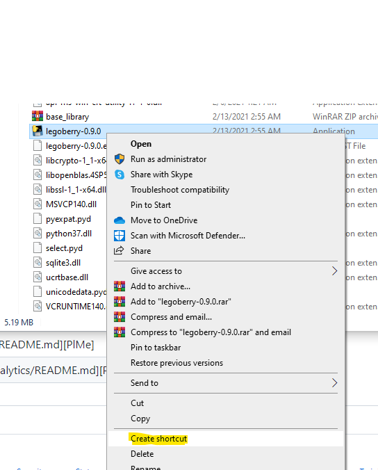

# What is legoberry?
It's Data Engineering in a box! Well, in yaml...
legoberry is a utility to merge multiple csv files into 1 or more files. It takes in a schema and does simple transformations stated below. 
# How to run legoberry
1. create a config.yml in your legoberry folder.
2. drop all source csv files to be merged into the legoberry folder
3. navigate to the legoberry-x.x.x folder
4. find the legoberry-x.x.x executable, right click, and create a shortcut

5. copy the shortcut to the parent legoberry folder


## Config Options
This file must be named config.yml. Sometimes windows file explorer doesn't show  
_note_: a period in the "parameter" field denotes a child item
| parameter | description | example |
| ------ | ------ | ------ |
| type | school level  like HS or MS| ES |
| target_file | name of file where source csvs will be merged | master.csv |
| ordered_headers | a list of headers to be ordered  |<pre> ordered_headers: </br>  - 'first'</br>  - 'last'</br>  - 'e-mail - work' </br>  - 'grade level'</br>  - 'tag'</br>  - 'lead'</br>  - 'school' </pre> |
| fields | a list of different fields to be sourced from the source files. you must call out source and target name even if they are the same |<pre> fields: </br>  - source_name: 'FIRST_NAME'</br>    target_name: 'first'</pre> |
| fields.source_name | column name in the source file. must be in quotes | 'P_STATE'|
| fields.secondary_source_name | 2nd option for source name in case different files refer to the same field differently| 'STATE' |
| fields.target_name | column name to rename to in the target file. must be in quotes | 'tag'|
| fields.replace | list of different values in the data of this field to replace| <pre>replace:</br>  - from: 'Early Childhood Educator'</br>    to: 'prek'</pre>|
| fields.replace.from| source data string to replace| 'Kindergarden Teacher'|
| fields.replace.to | target string to replace the from string to| 'kinder'|
| fields.default_value| new field to be created with hardcoded values. this only works if there is no source_name field specified| 'mch|
| fields.allow_special_char_list|  special characters to include when creating a new field using `default_value`. Only required if setting `source_fields_alpha_only` to True  | `['-']`|
| fields.source_fields_alpha_only| When setting `default_value`, this allows for only alpha characters be used. | `true` |
|fields.split_by| a string in quotes to split a field value into| if field has `'martin licea'`. you would use ` ' ' ` as this parameter to split `martin` and `licea`|
|fields.split| a list of target column names to split into. This field only works if you're using split_by||
|fields.split.index| if you split `martin licea` into 2, `martin` would be index 1 and `licea` would be index 2|2|
|fields.split.target_name | name of new field to be created from the split| 'first|
|max_target_file_size| the maximum number of rows the target file can contain. this will create multiple files if this number is smaller than the total aggregated rows.| 500 |


sample config 
```yaml
type: 'HS'
target_file: 'master.csv'
log: 'log.txt'
ordered_headers:
  - 'first'
  - 'last'
  - 'e-mail - work' 
  - 'grade level'
  - 'tag'
  - 'lead'
  - 'school'
fields: 
- source_name: 'PERS_NAME'
  split_by: ' '
  split:
  - index: 2
    target_name: 'first'
  - index: 3
    target_name: 'last'
- source_name: 'FIRST_NAME'
  target_name: 'first'
- source_name: 'LAST_NAME'
  target_name: 'last'
- source_name: 'PERS_EMAIL'
  target_name: e-mail - work
- source_name: 'TITLE1'
  target_name: grade level
  replace:
  - from: 'Early Childhood Educator'
    to: 'prek'
  - from: 'Kindergarten Teacher'
    to: 'kinder'
  - from: '1st Grade Teacher'
    to: 'grade 1'
  - from: '2nd Grade Teacher'
    to: 'grade 2'
  - from: '3rd Grade Teacher'
    to: 'grade 3'
  - from: '4th Grade Teacher'
    to: 'grade 4'
  - from: '5th Grade Teacher'
    to: 'grade 5'
  - from: '6th Grade Teacher'
    to: 'grade 6'
  - from: 'Special Needs Educator'
    to: 'sped'
  - from: 'Math Educator'
    to: 'unknown'
  - from: 'Social Studies Educator'
    to: 'unknown'
  - from: 'Elementary Teacher'
    to: 'unknown'
  - from: 'Language Arts Educator'
    to: 'reading'
- source_name: 'P_STATE'
  secondary_source_name: 'STATE'
  target_name: 'tag'
- source_name: 'MANAGER'
  target_name: 'lead'
- source_name: 'I_SHORT_NM'
  secondary_source_name: 'filename' # new field
  target_name: 'school'
- target_name: 'lead'
  default_value: 'mch' #new field. Only works if there is no source_name field.
max_target_file_size: 500
```
## Running Tests
To install dependencies for testing:
```
pip install -r requirements-test.text
```
Run all unit tests with Pytest:
```
pytest tests/unit
```
